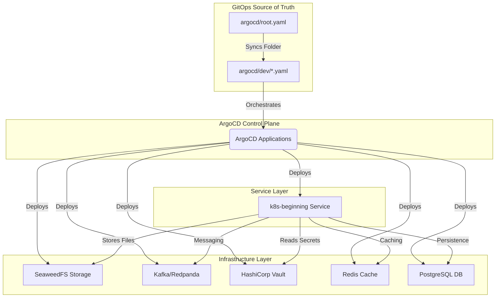

# K8s DevOps GitOps Repository

This repository manages the deployment of the **k8s-beginning** application and its associated infrastructure using **GitOps** principles with ArgoCD and Helm.

## 🏗 Architecture & Flow

This repository follows the **"App of Apps"** pattern for multi-cluster configuration management. A root ArgoCD application tracks the `argocd/root.yaml` manifest, which in turn orchestrates all individual infrastructure and service applications.



## 📂 Repository Structure

```text
.
├── apps/                   # Helm Charts (Infrastructure & Services)
│   └── dev/
│       ├── k8s-beginning/  # Main application service
│       ├── kafka/          # Redpanda-based messaging
│       ├── postgres/       # Relational database
│       ├── redis/          # Distributed cache
│       ├── seaweed/        # Distributed object/file storage
│       └── vault/          # Secret management
├── argocd/                 # ArgoCD Application Manifests
│   ├── root.yaml           # App-of-Apps Root
│   └── dev/                # Component definitions
├── docs/                   # Platform documentation
└── README.md               # Project overview
```

## 🛠 Platform Stack

### Storage & Database
- **SeaweedFS**: Distributed object store and file system. Used for high-volume file storage and chunking.
- **PostgreSQL**: Primary relational database for application state.
- **Redis**: In-memory data store used for caching and session management.

### Messaging & Security
- **Kafka (Redpanda)**: High-performance streaming platform for event-driven communication.
- **HashiCorp Vault**: Secure secret management and sensitive configuration storage.

### GitOps & Orchestration
- **ArgoCD**: Declarative continuous delivery tool for Kubernetes.
- **Helm**: Package manager for Kubernetes, used to template all components.

## 📚 Documentation

The documentation has been divided into focused topics inside the `docs/` directory:

- [**Cluster Setup**](docs/01-cluster-setup.md): Instructions on initial cluster and ArgoCD setup.
- [**Deploying Apps**](docs/02-deploying-apps.md): How to bootstrap applications and the GitOps auto-sync cycle.
- [**Operations & Commands**](docs/03-operations.md): Relevant commands to run, apply, manually sync, and rollback.
- [**Troubleshooting**](docs/04-troubleshooting.md): Common errors and fixes.
- [**GitOps Flow**](docs/05-flow.md): Detailed explanation of the end-to-end development and deployment cycle.

## Fix VM can't access argo UI
- `systemctl restart k3s && sleep 30 && kubectl delete pods -n argocd --all`