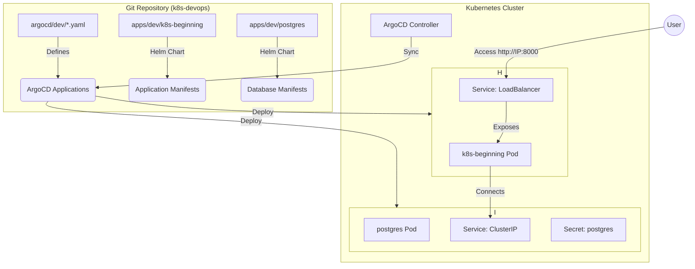

# K8s DevOps GitOps Repository

This repository manages the deployment of the **k8s-beginning** application and its associated infrastructure using **GitOps** principles with ArgoCD and Helm.

## 🏗 Architecture & Flow

The following diagram illustrates the GitOps workflow and the interaction between components within the Kubernetes cluster:



## 📂 Repository Structure

```text
.
├── apps/
│   ├── dev/
│   │   ├── k8s-beginning/      # Helm chart for the main service
│   │   │   ├── templates/      # K8s manifest templates
│   │   │   └── values.yml       # Dev configuration (LoadBalancer, resources)
│   │   ├── postgres/           # Helm chart for PostgreSQL
│   │   │   ├── templates/      # PVC, Secret, Deployment, Service
│   │   │   └── values.yaml      # DB credentials and image config
│   │   └── namespace.yaml      # Namespace definitions
│   └── prod/                   # Production manifests (placeholder)
├── argocd/
│   └── dev/
│       ├── k8s-beginning.yaml  # ArgoCD App for the main service
│       └── postgres.yaml       # ArgoCD App for PostgreSQL
├── README.md                   # Project overview
└── SETUP_GUIDE.md              # Installation and deployment guide
```

## 🚀 Key Components

### ArgoCD
Uses the **GitOps** pattern to ensure the cluster state matches the configuration in this repository. 
- All applications are defined in `argocd/dev/`.
- Automatic synchronization is enabled for the `main` branch.

### k8s-beginning Service
A Go-based (Kratos) application that provides a greeting service and a health check endpoint.
- **Port:** 8000 (HTTP), 9000 (gRPC)
- **Health Check:** `/healthz`
- **Exposure:** Exposed via `LoadBalancer` (NodePort on K3s).

### PostgreSQL
The backend database for `k8s-beginning`.
- **Hostname:** `postgres.dev.svc.cluster.local`
- **Database:** `anh_k8s_db`
- **Credentials:** Managed via Kubernetes Secrets.

## 📚 Documentation
- [**Setup Guide**](SETUP_GUIDE.md): Detailed instructions on cluster setup and initial deployment.
- [**Walkthrough**](https://github.com/besanh/k8s-devops/blob/main/walkthrough.md): History of fixes and verification steps.