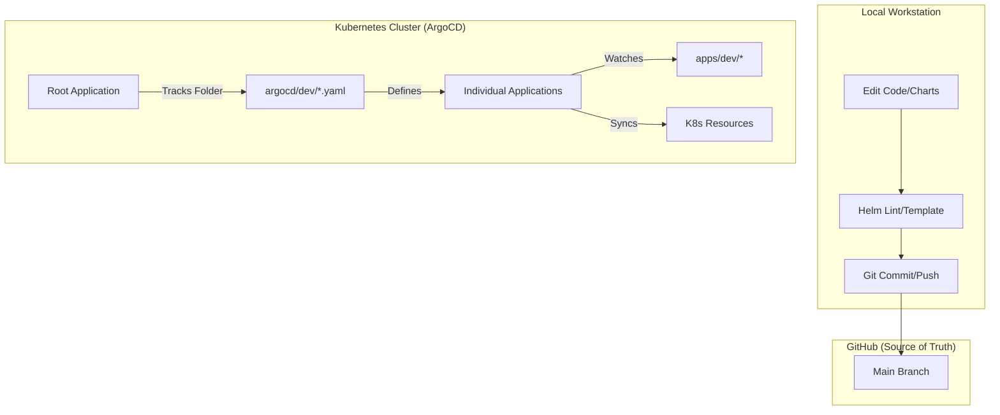

# GitOps Flow & Workflow

This document explains the end-to-end GitOps workflow for the **k8s-devops** repository, covering local development, deployment, and application retirement.

## 🏗 The Big Picture

The repository follows a declarative GitOps pattern using ArgoCD and Helm, orchestrated via the **"App of Apps"** pattern.



---

## 💻 The Developer Loop

Before pushing any changes to GitHub, you should always validate your Helm charts to catch mistakes early.

### 1. Edit Configuration
Modify the Helm charts in `apps/dev/` or the ArgoCD manifests in `argocd/dev/`.

### 2. Local Validation (MANDATORY)
Run these commands from the repository root:

```bash
# 1. Lint for syntax errors
helm lint apps/dev/<app-name>

# 2. Preview the rendered YAML (Dry-run)
helm template <app-name> apps/dev/<app-name>
```

### 3. Commit & Push
```bash
git add .
git commit -m "feat/fix: descriptive message"
git push origin main
```

---

## 🌊 Synchronization (Sync)

ArgoCD is configured with an **Automated Sync Policy**.

1. **Polling**: Every ~3 minutes, ArgoCD checks the GitHub repository for new commits.
2. **Out of Sync**: If a difference is detected, the application status changes to `OutOfSync`.
3. **Automated Sync**: ArgoCD immediately applies the changes to the cluster to match the Git state.
4. **Self-Healing**: If someone manually changes a resource in the cluster (e.g., via `kubectl edit`), ArgoCD will overwrite it to match Git.

---

## 🗑 Retiring Applications (The "Disabled" Guard)

To remove an application from the cluster **without deleting its code** from the Git repository:

1. **Create the disabled folder** (if it doesn't exist): `mkdir -p argocd/disabled`
2. **Move the manifest**: `mv argocd/dev/<app>.yaml argocd/disabled/`
3. **Commit & Push**:
   ```bash
   git add .
   git commit -m "chore: retire <app> application"
   git push origin main
   ```
4. **ArgoCD Behavior**: ArgoCD will see the manifest is gone from `argocd/dev/` and will delete all managed resources (Pods, Services, PVCs) from the cluster.
5. **Recovery**: To re-enable the app, simply move the file back to `argocd/dev/`.

---

## 🚨 Best Practices

- **Never `kubectl apply` manually** for resources managed by ArgoCD (except for the initial "Bootstrap").
- **Revert is a Commit**: To "undo" a deployment, use `git revert <commit-id>` and push.
- **Keep `argocd/dev/` Clean**: Only manifests in this folder are actively deployed. Use `argocd/disabled/` for "parked" applications.
